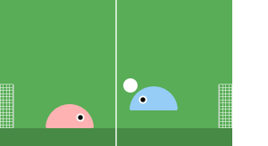
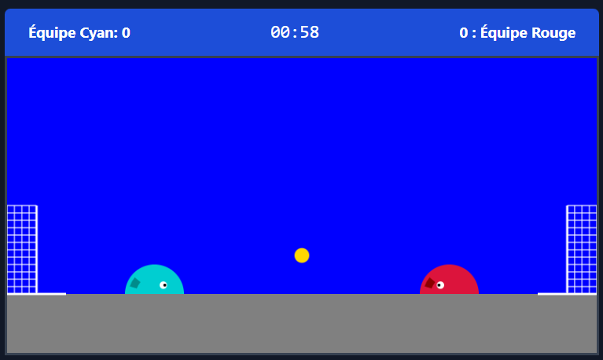
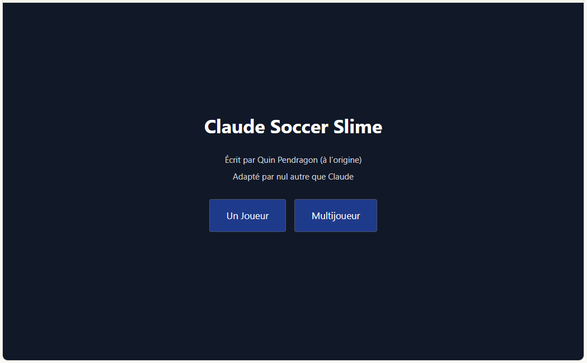
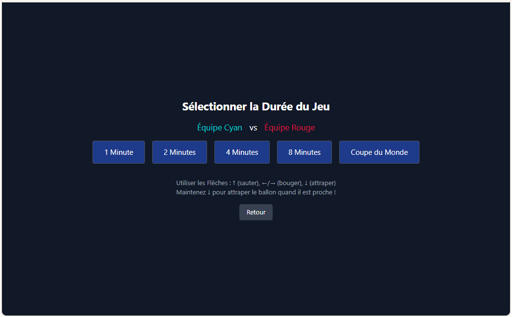

<table>
<tr>
<td></td>
<td><pre style="text-align:center; margin:0;">
   _____ _ _                      
  / ____| (_)                     
 | (___ | |_ _ __ ___   ___ _ __  
  \___ \| | | '_ ` _ \ / _ \ '__| 
  ____) | | | | | | | |  __/ |    
 |_____/|_|_|_|_|_|_|_|\___|_|    
 / __|/ _ \ / __/ __/ _ \ '__|    
 \__ \ (_) | (_| (_|  __/ |       
 |___/\___/ \___\___\___|_|       
</pre></td>
<td></td>
</tr>
</table>

**Prompt initial**

Créez un jeu de football 2D basé sur la physique intitulé “Slime Soccer” avec les caractéristiques suivantes :
- Deux slimes en demi-cercle (cyan à gauche, rouge à droite) sur un terrain bleu avec un sol gris
- Physique de la balle : gravité, rebonds, saisissable avec contrôle rotationnel
- Contrôles : Touches directionnelles (déplacement/saut/saisie) pour l'humain, adversaire IA pour le mode solo
- Buts avec filets des deux côtés, matchs chronométrés (1-8 minutes)
- Anti-camping : pénalisation des joueurs qui restent trop longtemps dans leur but
- Modes de jeu : solo contre l'IA, multijoueur local
- Style visuel : arcade rétro avec animations fluides et détection précise des collisions
Les slimes doivent être rebondissants et réactifs, la balle doit avoir une physique réaliste lors des tirs ou des saisies, et l'IA doit être stimulante mais équitable. Incluez un système de menu pour la sélection de la durée de jeu.

<table>
<tr>
   <td></td>
  <td></td>
  <td></td>
</tr>
</table>

---

    

